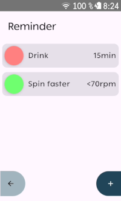
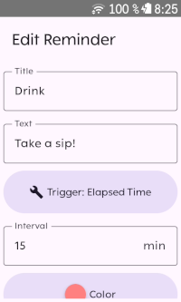
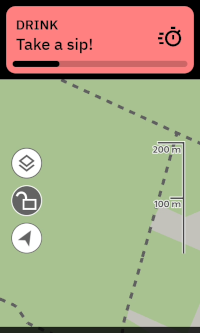

# Karoo Reminder Extension

Karoo extension that displays in-ride alerts based on custom triggers. Reminders can be set to activate after a specific time interval, distance traveled, energy output or when a sensor value is outside a defined range (e.g., heart rate exceeds zone 2).

Note that interval and distance reminders repeat at the specified intervals or distances, eg. every 10 minutes, or every 10 miles/kilometers, for example.

By default, created reminders are active for all ride profiles. If you want to limit reminders to specific ride profiles (e. g. your "Gravel" profile), you can do so in the reminder settings.

Compatible with Karoo 2 and Karoo 3 devices.

## Installation

This extension is available from the extension library on your Karoo device. Find more information on extensions in the [Hammerhead FAQ](https://support.hammerhead.io/hc/en-us/articles/34676015530907-Karoo-OS-Extensions-Library).

## Credits

- Icon is `timers` by [boxicons.com](https://boxicons.com) (MIT-licensed).
- Reminder sound played over bluetooth is `SweetAlertSound5.wav` by `KIZILSUNGUR` from [freesound.org](https://freesound.org/people/KIZILSUNGUR/sounds/72129/) (CC0).

## Links

[karoo-ext source](https://github.com/hammerheadnav/karoo-ext)
